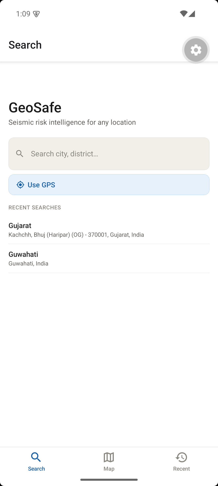
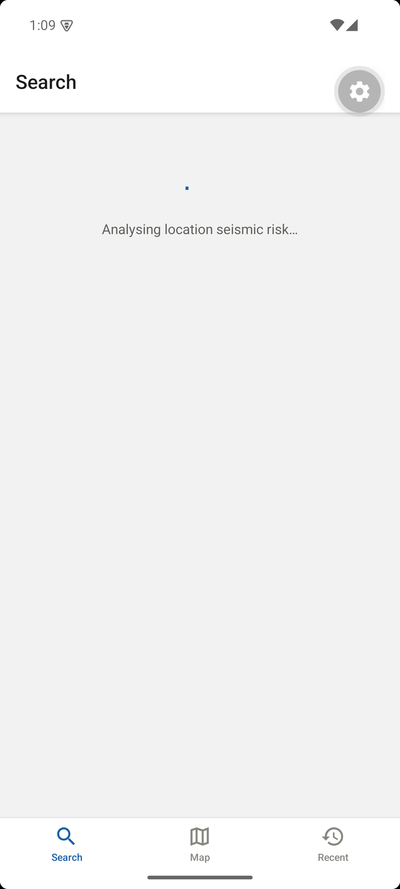
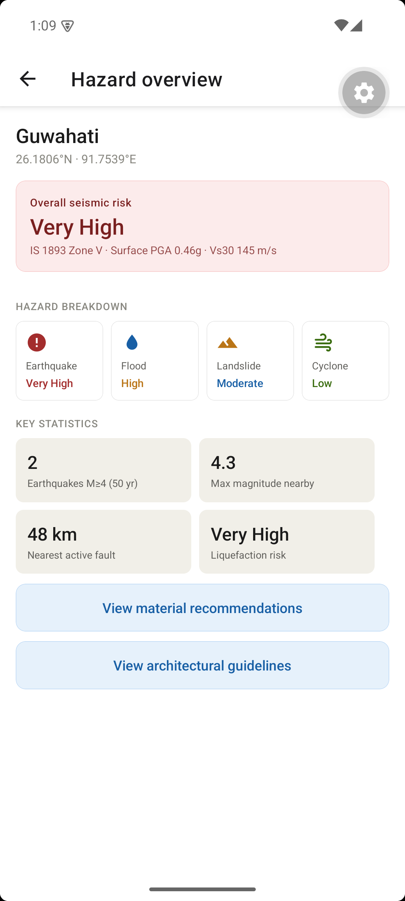
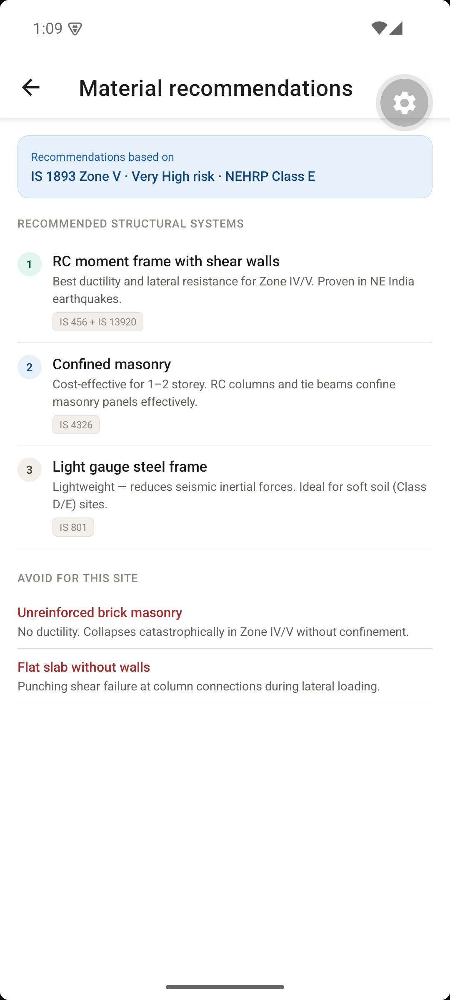
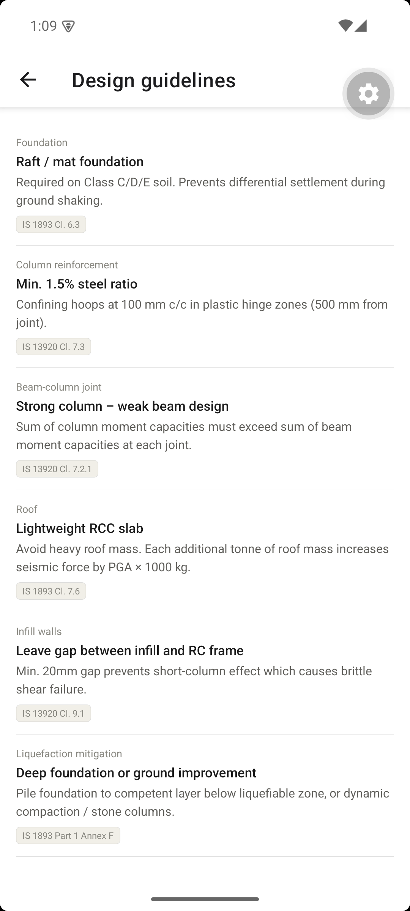
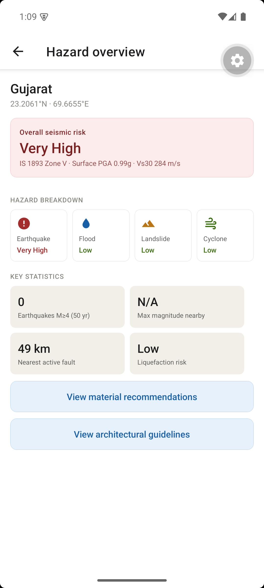
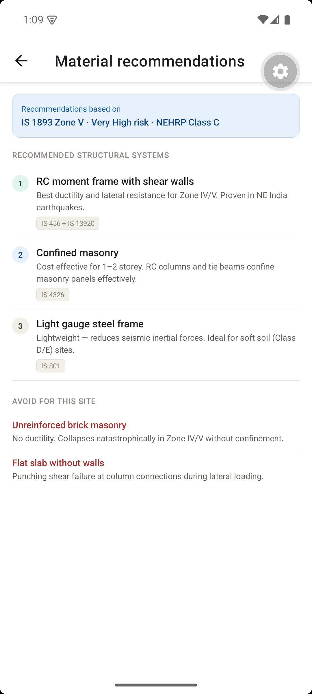
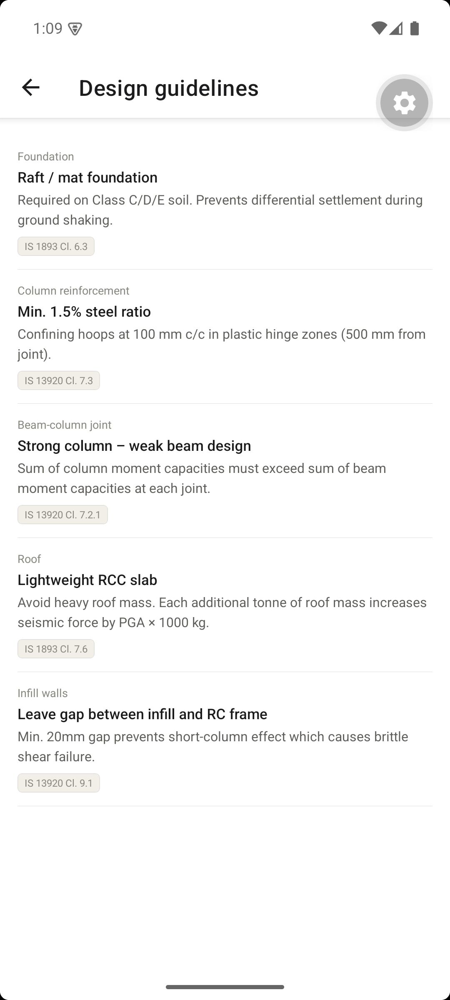

# GeoSafe — Seismic Risk Intelligence App

GeoSafe is a mobile application (React Native + Expo) paired with a Python FastAPI backend. It lets a user search any Indian city or use their phone's GPS to instantly see:

- IS 1893 seismic hazard zone (Zone II – V), resolved via shapefile point-in-polygon where available
- Bedrock PGA, site amplification factor, and surface PGA — as three separate numbers, not one blended value
- Vs30 and site class, resolved independently of the seismic zone (calibrated survey point → city interpolation → global raster → regional default)
- A second, independently-resolved SPT-N based site class, since it's documented to disagree with the Vs30-based one at some Indian sites
- The IS 1893 Part 1 Table 3 design response spectrum and the Cl 7.5.3 design base shear coefficient (Ah) — real code provisions, not estimates
- Historical earthquake data pulled live from USGS
- Flood, landslide, and cyclone risk estimates
- Recommended structural materials (with IS code references)
- Architectural and construction guidelines

The risk engine is rule-based (no ML model needed to run it). The architecture is designed so a trained XGBoost model can be dropped in later without changing any other code. Every resolved hazard/site value carries a `source` field (`measured` / `interpolated` / `modeled` / `assumed` / `shapefile` / `approximate`) so the app never presents a geological guess with the same confidence as a calibrated measurement.

## Screenshots

<table>
<tr>
<td align="center"><br/><sub>Search</sub></td>
<td align="center"><br/><sub>Analysing seismic risk</sub></td>
<td align="center"><br/><sub>Hazard overview — Guwahati (Zone V)</sub></td>
<td align="center"><br/><sub>Material recommendations — NEHRP Class E</sub></td>
</tr>
<tr>
<td align="center"><br/><sub>IS-code design guidelines</sub></td>
<td align="center"><br/><sub>Hazard overview — Bhuj (Gujarat)</sub></td>
<td align="center"><br/><sub>Material recommendations — NEHRP Class C</sub></td>
<td align="center"><br/><sub>Design guidelines — Bhuj</sub></td>
</tr>
</table>

---

## What Has Been Built

### 1. Expo Project Bootstrap

The React Native project was created using `create-expo-app` with the `blank-typescript` template. The following configuration changes were applied to match the spec:

**`app.json`** — Updated from the scaffold defaults to:
- Set `name: "GeoSafe"` and `slug: "geosafe"`
- Added `scheme: "geosafe"` (required by Expo Router for deep linking)
- Switched web bundler to `"metro"`
- Added iOS bundle identifier `com.geosafe.app` and the location permission description
- Added Android package name and `ACCESS_FINE_LOCATION` permission
- Registered `expo-router` and `expo-location` as Expo config plugins

**`package.json`** — Changed `"main"` from `"index.ts"` to `"expo-router/entry"` so Expo Router takes control of the app entry point.

---

### 2. All Dependencies Installed

#### Frontend (npm)

| Package | Version | Purpose |
|---|---|---|
| `expo-router` | ~56.2.11 | File-system based navigation (tabs + stack screens) |
| `expo-location` | ~56.0.18 | GPS coordinates and reverse geocoding |
| `expo-constants` | ~56.0.18 | Access to app config at runtime |
| `expo-linking` | ~56.0.14 | Deep link handling |
| `expo-status-bar` | ~56.0.4 | Controls iOS/Android status bar style |
| `react-native-safe-area-context` | ~5.7.0 | Handles notch/home-indicator safe areas |
| `react-native-screens` | 4.25.2 | Native screen containers (required by Router) |
| `@maplibre/maplibre-react-native` | 10.4.2 (pinned) | Map rendering — see "Coverage Map Screen" for why this version, not `react-native-maps` |
| `zustand` | ^5.0.14 | Lightweight global state management |
| `axios` | ^1.18.1 | HTTP client for FastAPI calls |
| `@react-native-async-storage/async-storage` | ^3.1.1 | Persistent key-value storage |
| `react-native-paper` | ^5.15.3 | Material Design UI components |
| `@expo/vector-icons` | ^15.1.1 | Icon set (MaterialCommunityIcons used throughout) |
| `react-native-vector-icons` | ^10.3.0 | Underlying icon library |

#### Backend (pip, Python 3.11)

| Package | Version | Purpose |
|---|---|---|
| `fastapi` | 0.111.0 | Web framework for the REST API |
| `uvicorn[standard]` | 0.29.0 | ASGI server that runs FastAPI |
| `httpx` | 0.27.0 | Async HTTP client used to call USGS API |
| `pydantic` | 2.7.1 | Request/response data validation and serialisation |
| `python-dotenv` | 1.0.1 | Loads `.env` file into environment variables |
| `numpy` | >=2.0.0 | Numerical operations (ready for ML model swap-in) |
| `geopandas` | >=0.14.0 | Loads the IS 1893 zone shapefile and runs point-in-polygon zone queries |
| `shapely` | >=2.0.0 | Point/polygon geometry used by the zone query and raster bounds check |
| `rasterio` | >=1.3.0 | Windowed pixel reads against the USGS Global Vs30 GeoTIFF |

> **Note:** Python 3.14 (system default on this machine) does not yet have pre-built wheels for `pydantic-core`. The virtual environment was created with **Python 3.11** (Homebrew) which has full support.

---

### 3. Complete File Structure

```
GeoSafe/
├── app/                          ← All screens (Expo Router file-based routing)
│   ├── _layout.tsx               ← Root stack navigator
│   ├── (tabs)/
│   │   ├── _layout.tsx           ← Bottom tab bar (Search / Map / Recent)
│   │   ├── index.tsx             ← Home / Search screen
│   │   ├── map.tsx               ← Interactive seismic map screen
│   │   └── history.tsx           ← Recent searches screen
│   └── results/
│       ├── [locationId].tsx      ← Hazard overview (dynamic route)
│       ├── earthquake.tsx        ← Earthquake data detail screen
│       ├── materials.tsx         ← Structural material recommendations screen
│       └── guidelines.tsx        ← IS-code architectural guidelines screen
├── components/
│   ├── SearchBar.tsx             ← Search input + GPS button
│   ├── RiskBanner.tsx            ← Coloured overall-risk banner
│   ├── HazardCard.tsx            ← Single hazard type card (earthquake/flood/etc)
│   ├── MaterialCard.tsx          ← Ranked material recommendation card
│   ├── GuidelineItem.tsx         ← Single IS-code guideline row (used by guidelines.tsx)
│   ├── EmptyState.tsx            ← Shared "no result yet" placeholder for results screens
│   ├── ErrorBoundary.tsx         ← Catches render errors app-wide, shows a reset button
│   └── LoadingOverlay.tsx        ← Spinner shown while API call is in progress
├── services/
│   ├── api.ts                    ← Axios client + analyzeLocation() function
│   ├── geocoding.ts              ← OpenCage geocoding (text → lat/lon)
│   └── location.ts               ← Expo Location (GPS + reverse geocode)
├── store/
│   └── useLocationStore.ts       ← Zustand global state, recentSearches persisted via AsyncStorage
├── types/
│   └── index.ts                  ← All TypeScript interfaces
├── constants/
│   ├── colors.ts                 ← Design system colour tokens
│   └── riskConfig.ts             ← Zone labels, risk-level colour mappings, hazard icons
├── scripts/
│   ├── validate_vs30.py          ← Compares the global Vs30 raster against calibrated boreholes
│   └── check_build_data.py       ← Render build-time gate: fails the build if required data files are missing/empty
├── backend/
│   ├── main.py                   ← FastAPI entry point: CORS, rate limiting, error logging, startup loaders, /health
│   ├── rate_limit.py             ← Shared slowapi Limiter instance (avoids a circular import with routers/analyze.py)
│   ├── requirements.txt          ← Python dependency list
│   ├── routers/
│   │   └── analyze.py            ← POST /api/analyze route handler (rate-limited, 20/min per IP)
│   ├── services/
│   │   ├── usgs.py               ← Fetches earthquakes from USGS FDSN API
│   │   ├── inference.py          ← Rule-based IS 1893 zone + PGA + Vs30 + risk engine
│   │   └── vs30_raster.py        ← Opens the USGS Global Vs30 GeoTIFF, windowed pixel reads
│   ├── data/
│   │   ├── site_calibration.py   ← Calibrated Vs30 / SPT-N points and city-level Vs30 regions
│   │   ├── zone_loader.py        ← Loads the IS 1893 zone shapefile once, at startup
│   │   ├── is1893_zones/         ← (not bundled) place the real zone shapefile here
│   │   └── global_vs30/          ← (not bundled) place the real USGS Global Vs30 GeoTIFF here
│   └── models/
│       └── schemas.py            ← Pydantic request/response models
├── app.json                      ← Expo app configuration (static — no env-dependent native config needed)
├── package.json                  ← npm dependencies and scripts
├── tsconfig.json                 ← TypeScript compiler config
├── .env.example                  ← Template for .env/.env.local (committed; real keys are not)
└── .env                          ← API URL (not committed to git)
```

---

### 4. Detailed File Descriptions

#### `types/index.ts`
Defines every TypeScript interface used across the app. Key types:
- `LocationResult` — the full response shape returned by the backend. Ground motion is split into
  `bedrockPga`, `amplificationFactor`, and `surfacePga` (= bedrock × amplification) instead of one
  PGA number, so severe shaking from bedrock proximity isn't confused with soft-soil amplification.
  Site class is likewise split into `siteClassVs30` (always present) and `siteClassSpt` (nullable —
  Vs30-based and SPT-N-based classification are documented to disagree at some Indian sites).
  `vs30Source`, `siteClassVs30Source`, `siteClassSptSource`, `amplificationFactorSource`, and
  `seismicZoneSource` report how each value was resolved (see `SiteDataSource` below).
- `SiteDataSource` — `'measured' | 'interpolated' | 'modeled' | 'assumed'`, in decreasing order of
  confidence
- `HazardSummary` — one row in the hazard breakdown (type + level + description)
- `EarthquakeRecord` — one USGS earthquake entry
- `MaterialRecommendation` — one ranked construction material with IS code
- `ArchitecturalGuideline` — one design rule with IS code reference
- `SearchResult` — a geocoding suggestion (name, display name, lat, lon)

#### `constants/colors.ts`
Single source of truth for all colours. Structured as:
- `Colors.primary` / `primaryLight` / `primaryBorder` — brand blue tones
- `Colors.risk.low/moderate/high/veryHigh` — each has `bg`, `border`, `text`, `dot` for consistent risk-level styling
- `Colors.hazard.*` — per-hazard-type accent colours
- `Colors.surface.*` — background and border neutrals
- `Colors.text.*` — primary / secondary / muted text

#### `constants/riskConfig.ts`
Maps data values to display values:
- `RISK_COLORS` — maps `"Low" | "Moderate" | "High" | "Very High"` to the colour objects above
- `ZONE_LABELS` — maps `"II"–"V"` to human-readable descriptions
- `ZONE_RISK` — maps IS 1893 zone to risk level string
- `HAZARD_ICONS` — maps hazard type to MaterialCommunityIcons icon name

#### `store/useLocationStore.ts`
Zustand store, wrapped in `persist` with `createJSONStorage(() => AsyncStorage)`. Holds:
- `currentResult` — the last `LocationResult` fetched from the backend (shared across all result screens). **Not** persisted — cleared on app restart, which is why the results screens need an empty state (see `components/EmptyState.tsx`).
- `recentSearches` — up to 10 past searches. **Persisted** to AsyncStorage (via `partialize`), so they survive app restarts.
- `loading` / `error` — global UI state flags, not persisted
- Actions: `setCurrentResult`, `addRecentSearch`, `setLoading`, `setError`, `clearError`

#### `services/api.ts`
- Creates an Axios client via `resolveBaseUrl()`. Resolution order:
  1. `process.env.EXPO_PUBLIC_API_URL`, if set — explicit override, always wins. **Leave this unset** in normal use (see `.env`) — it applies to every target at once and is what breaks the Android emulator if left pointed at `localhost`.
  2. In `__DEV__` only: the LAN host from `Constants.expoConfig.hostUri`, if it's a real address (not `localhost`/`127.0.0.1`) — covers a physical device on the same Wi-Fi, and survives the Mac's LAN IP changing.
  3. In `__DEV__` otherwise: `Platform.OS === 'android' ? 'http://10.0.2.2:8000/api' : 'http://localhost:8000/api'` — inside the Android emulator, `localhost` resolves to the emulator itself, not the host machine; Android maps the host to `10.0.2.2` instead. The iOS Simulator shares the Mac's network stack directly, so plain `localhost` works there.
  4. Final fallback: `http://localhost:8000/api`
  - Logs the resolved URL once at module load (`console.log`, `__DEV__` only) so it's visible in the Metro console.
- Exports `describeApiError(error)` — Axios' bare "Network Error" isn't actionable, so this turns a response-less Axios error into a message naming the resolved base URL and the required `--host 0.0.0.0` flag; any other error just passes its message through.
- Exports `analyzeLocation(params)` which POSTs `{ lat, lon, location_name, floors, building_type }` to the backend and returns a typed `LocationResult`. Also stashes `params` as the module-level "last analyze request", readable via `getLastAnalyzeRequest()` — used only by `ErrorBoundary.tsx` to attach recent-request context to a crash log, never for anything functional.

| Test target | Backend URL used | Why |
|---|---|---|
| Android emulator | `http://10.0.2.2:8000/api` | The emulator's virtual network maps the host machine to `10.0.2.2`; `localhost` inside the emulator means the emulator itself |
| iOS Simulator | `http://localhost:8000/api` | The Simulator shares the Mac's network stack directly, so `localhost` reaches the Mac |
| Physical device (Expo Go / dev build) | `http://<Mac's LAN IP>:8000/api` | Auto-detected from `Constants.expoConfig.hostUri` — the same address Metro is already reachable on over Wi-Fi |

In every case, the backend must be started with `--host 0.0.0.0` (see below) — otherwise it only accepts connections from the Mac itself, regardless of which address the app resolves to.

#### `services/geocoding.ts`
- Calls OpenCage Geocoding API with `countrycode=in` to restrict results to India
- Falls back gracefully (returns centre-of-India coordinates) if no API key is set or the call fails, so the app always works

#### `services/location.ts`
- `requestLocationPermission()` — asks iOS/Android for foreground location permission
- `getCurrentCoordinates()` — returns `{ lat, lon }` from device GPS
- `reverseGeocode()` — converts coordinates back to a place name using Expo's built-in geocoder

#### `components/SearchBar.tsx`
Renders a styled text input (with a magnify icon) and a "Use GPS" button side by side. Accepts `value`, `onChangeText`, `onGpsPress`, and `loading` props.

#### `components/RiskBanner.tsx`
A coloured card that shows the overall risk level (`Low` / `Moderate` / `High` / `Very High`) with its matching background and border colour. Also displays IS 1893 zone, **surface PGA** (`surfacePga` — bedrock PGA already multiplied by the site amplification factor), and Vs30.

#### `components/HazardCard.tsx`
A compact touchable card for one hazard type. Shows an icon (colour-coded by hazard type), the hazard name, and the risk level. Used in a grid of four on the results overview screen.

#### `components/MaterialCard.tsx`
Displays one ranked structural material recommendation with:
- A numbered circle (colour changes by rank: green → blue → grey)
- Material name and reason
- IS code badge

#### `components/GuidelineItem.tsx`
One IS-code-referenced design guideline row: category label, recommendation, detail text, and IS code badge. Extracted out of `app/results/guidelines.tsx` so the screen itself is just a list-mapping shell.

#### `components/EmptyState.tsx`
Shared placeholder shown by all four `app/results/*` screens when `currentResult` is `null` (e.g. after an app restart, since `currentResult` is deliberately not persisted). Takes an icon, title, message, and an optional action button — each screen wires the button to `router.replace('/(tabs)')` to send the user back to Search.

#### `components/ErrorBoundary.tsx`
A class-component error boundary (`getDerivedStateFromError` / `componentDidCatch`) wrapping the root `<Stack>` in `app/_layout.tsx`. Catches otherwise-uncaught render errors anywhere in the app and shows a "Try again" reset button instead of a blank white screen. `componentDidCatch` logs a single structured, grep-able line — `[GEOSAFE_CRASH] component=... message=... lastAnalyzeRequest=... stack=...` — pulling the failing component's name out of `info.componentStack` and the most recent `analyzeLocation()` request (if any) from `services/api.ts`'s `getLastAnalyzeRequest()`, so a "the app crashed" report carries real debugging context. This is deliberately just a structured `console.error`, not a crash-reporting SDK (this is a research prototype); it lands in the Metro/device console, not Render, since the frontend doesn't run on Render — only `backend/main.py`'s `GEOSAFE_ERROR` lines do.

#### `components/LoadingOverlay.tsx`
Full-screen centred spinner shown while the backend call is in progress.

#### `app/_layout.tsx`
The root Stack navigator, wrapped in `ErrorBoundary`. Defines all screen routes and their header titles:
- `(tabs)` — the tab group (no header, tabs handle their own headers)
- `results/[locationId]` — Hazard overview
- `results/earthquake` — Earthquake analysis
- `results/materials` — Material recommendations
- `results/guidelines` — Design guidelines

#### `app/(tabs)/_layout.tsx`
The bottom tab bar. Three tabs: Search (magnify icon), Map (map-outline icon), Recent (history icon). Active tab uses brand blue.

#### `app/(tabs)/index.tsx` — Home / Search Screen
- Renders the `SearchBar`. Below 3 characters, no request is made; at 3+ characters, `searchLocations()` fires 400ms after typing stops (debounced via `setTimeout` + `clearTimeout`, not on every keystroke) — this keeps a full search like "Guwahati" to one OpenCage request instead of six
- Shows an autocomplete suggestion list while typing
- On selection, calls `analyzeLocation()`, saves the result to the store, adds to recent searches, and navigates to `/results/[locationId]`
- Also shows recent searches when the input is empty
- Shows `LoadingOverlay` while the API call is running

#### `app/(tabs)/map.tsx` — Coverage Map Screen
Fetches `/api/coverage` on mount and renders every region as a `FillLayer`+`LineLayer` pair over a `ShapeSource` (dashed line for a provisional bbox, solid for a real survey-derived boundary — see `geometrySource`) plus a `CircleLayer` per calibrated point (fixed 20px radius — MapLibre's `circleRadius` is in screen pixels, not metres, so a true-to-scale circle needs per-zoom expression math this app doesn't do), both colour-coded via `SOURCE_COLORS`. Tapping the map drops a draggable `PointAnnotation` and calls `/api/coverage/check` (debounced 300ms on drag) to show a bottom sheet with the expected data source and a "Run full analysis" action. Region chips above the map pan/zoom to a region's real bounds via the `Camera` ref's `fitBounds()`.

**Map renderer**: this app uses [MapLibre](https://maplibre.org/) (`@maplibre/maplibre-react-native`), not `react-native-maps` — specifically because `react-native-maps` requires the Google Play Services Maps SDK as its native renderer on Android *regardless of tile source* (a custom tile overlay like `UrlTile` only draws on top of that renderer, it doesn't replace it), which means a mandatory Google Cloud project and API key just to see a map at all. MapLibre is a fully independent open-source renderer (a fork of Mapbox GL Native from before Mapbox's licence change) with no such requirement, on either platform.

**Map tiles**: rendered via our own `RasterSource`/`RasterLayer` (not a hosted MapLibre demo style, so there's no dependency on MapLibre's own servers either). Two options, both OSM-based:
- **MapTiler** (`https://api.maptiler.com/maps/streets-v2/{z}/{x}/{y}.png?key=...`) if `EXPO_PUBLIC_MAPTILER_KEY` is set — free tier is 100,000 map loads/month, an account is required but **no billing/credit card**. Get a key at [maptiler.com](https://www.maptiler.com/) (Cloud → Keys).
- **Plain OpenStreetMap** (`https://tile.openstreetmap.org/{z}/{x}/{y}.png`) if the key is left unset — needs no signup at all. This is the zero-setup path for offline/CI use, and the fallback if you never configure MapTiler.

Neither path needs a Google Cloud project, billing account, or `android.config.googleMaps` block in `app.json` — and there isn't one.

OSM's [tile usage policy](https://operations.osmfoundation.org/policies/tiles/) is meant for light, non-production use — it asks for a descriptive `User-Agent` identifying the app (not the default RN/OkHttp one, which this app does not currently set for the OSM fallback path — worth fixing before any real traffic) and prohibits bulk/automated tile downloading. The `© OpenStreetMap contributors` line in the map legend is required either way by OSM's data licence (ODbL), not optional styling — MapTiler's own style still derives from OSM data. If this app sees real traffic, use the MapTiler path (or another paid provider / self-hosted tiles) rather than hammering OSM's free public server directly.

#### `app/(tabs)/history.tsx` — Recent Searches Screen
Reads `recentSearches` from the Zustand store and renders them as a tappable list. Tapping re-runs the analysis for that location and navigates to the results.

All four screens under `app/results/` render `<EmptyState>` instead of a blank screen when `currentResult` is `null` (e.g. right after an app restart).

#### `app/results/[locationId].tsx` — Hazard Overview (Dynamic Route)
The main results screen. Shows:
- Location name and coordinates
- `RiskBanner` with overall risk and surface PGA
- A grid of four `HazardCard`s (earthquake, flood, landslide, cyclone)
- Four stat boxes (earthquake count, max magnitude, fault distance, liquefaction risk)
- Buttons to navigate to Materials and Guidelines screens

#### `app/results/earthquake.tsx` — Earthquake Analysis
Shows a site parameters card: IS 1893 zone, **bedrock PGA**, **amplification factor**, **surface PGA** (bedrock × amplification, shown as three separate rows rather than one blended number), Vs30, **site class (Vs30)**, **site class (SPT-N)** (or "Not surveyed"), fault distance, and liquefaction risk. When both site classes are known and disagree, a warning banner explains this is a documented discrepancy in Indian soils, not a data error. Below that, a list of recent earthquakes fetched from USGS, each labelled Light / Moderate / Strong with a colour-coded pill.

#### `app/results/materials.tsx` — Material Recommendations
Shows a banner summarising the basis for recommendations (using the Vs30-based site class), then lists suitable structural systems via `MaterialCard` components, followed by a list of materials to avoid.

#### `app/results/guidelines.tsx` — Architectural Guidelines
Maps `result.guidelines` to `<GuidelineItem>` rows — IS-code-referenced design rules (foundation type, column steel ratio, beam-column joint design, roof weight, infill wall gaps), each with a category label, recommendation, detail text, and IS code badge.

#### `backend/main.py`
FastAPI application entry point.

- **CORS**: origins come from `CORS_ALLOWED_ORIGINS` (comma-separated) if set, otherwise default to just the Expo dev client/web preview's localhost origins — never a wildcard by default. See [Deploying the Backend (Render)](#deploying-the-backend-render) for why `*` is a deliberate, documented option in production for this specific app (public, read-only, no auth), not a default.
- **Rate limiting**: wires up the shared `slowapi` limiter (`rate_limit.py`) — see `routers/analyze.py`, which is the only endpoint actually decorated with a limit.
- **Error logging**: one `@app.exception_handler(Exception)` catches anything not already handled by FastAPI's own HTTPException/validation-error paths, and logs a single grep-able `GEOSAFE_ERROR` line (path, client IP, request body, full traceback) before returning a clean 500. A small `@app.middleware("http")` (`_capture_request_body`) captures each request's raw body up front so it's still readable from that handler — Starlette can't re-read a body stream the route already consumed.
- **Startup loaders**: three `@app.on_event("startup")` hooks each wrap their loader (`load_zones()` in `data/zone_loader.py`, `load_raster()` in `services/vs30_raster.py`, `load_faults()` in `services/faults.py`) in its own `try`/`except` so a failure in any one can never crash app boot — each loader already catches its own errors internally too, so this is a second, independent line of defense.
- **`GET /health`** returns `{status, message, dataSources: {seismicZones, vs30Raster, activeFaults}}` — the three booleans report whether each dataset is actually loaded right now, so a broken deploy (missing file, failed load) is visible immediately from this one endpoint instead of only being discovered when a user's `/analyze` silently degrades to fallback values.

#### `backend/routers/analyze.py`
Single route: `POST /api/analyze`, rate-limited to 20 requests/minute per client IP via `@limiter.limit(...)` (`rate_limit.py`) — this is by far the most expensive endpoint (shapefile query + raster read + fault geometry + a live USGS call), so it's the one guarded against a retry loop or accidental double-tap. Exceeding the limit returns `429` with a clear JSON message and an accurate `Retry-After` header (computed from the actual rate-limit window, not a hardcoded guess). Orchestrates all backend services:
1. Resolves the IS 1893 zone (shapefile point-in-polygon, or the bounding-box fallback)
2. Resolves Vs30 and the Vs30-based site class (calibrated point → city interpolation → global raster → regional default)
3. Resolves the SPT-N-based site class independently, if a calibrated point exists (else `null`)
4. Computes bedrock PGA (zone + fault distance) and the amplification factor (Vs30/soil, independent of zone), then `surfacePga = bedrockPga × amplificationFactor`
5. Fetches earthquakes from USGS asynchronously
6. Generates materials, guidelines, and hazards from the inference engine (still driven by the Vs30-based site class)
7. Returns a fully populated `AnalyzeResponse`, with a `*Source` field alongside every resolved value

#### `backend/services/inference.py`
The core rule-based engine. Vs30 and the IS 1893 zone are resolved as **independent inputs** — Vs30
used to be derived from the zone, which meant every downstream value (site class, liquefaction, PGA,
materials, guidelines) collapsed into a function of the zone alone. Functions:

- `get_is1893_zone(lat, lon) -> ZoneResult(zone, source)` — resolves via point-in-polygon query
  against the shapefile loaded by `data/zone_loader.py` (`source="shapefile"`). Falls back to
  `get_is1893_zone_bbox(lat, lon)`, the original bounding-box rules, when the shapefile is missing,
  fails to load, or doesn't cover the point (`source="approximate"`).
- `get_vs30(lat, lon) -> Vs30Result(vs30, site_class, source)` — **never calls `get_is1893_zone()`**.
  Resolves in order of decreasing confidence:
  1. A calibrated field measurement within 2 km (`data/site_calibration.py`) — `source="measured"`
  2. Interpolation across a known city survey area (Guwahati, Dehradun, Bhuj) — `source="interpolated"`
  3. The USGS Global Vs30 raster (`services/vs30_raster.py`) — real but coarse (~1km, topographic-slope
     proxy) and ranked below the curated city data until validated at city scale, see
     `scripts/validate_vs30.py` — `source="modeled"`
  4. A coarse regional geological default, keyed to geomorphological province (alluvial basin /
     foothill / hard-rock shield), not to seismic zone — `source="assumed"`
- `get_site_class_spt(lat, lon) -> Optional[Tuple[str, str]]` — SPT-N (IS 1893) based site
  classification, resolved independently of Vs30 from a separate calibrated dataset. Returns `None`
  (not a copy of the Vs30-based class) wherever no SPT-N survey point exists — Vs30-based and
  SPT-N-based classification are documented to disagree at some Indian sites, so one is never
  derived from the other.
- `get_site_class(vs30)` — maps Vs30 to NEHRP site class (A–E); used for the "assumed" tier and by
  the raster tier, since calibrated/interpolated tiers carry their own curated site class label
- `get_bedrock_pga(zone, distance_to_fault_km)` — rock-level ground motion from IS 1893 zone PGA,
  attenuated by fault distance. Independent of Vs30/soil.
- `get_amplification_factor(lat, lon, vs30_result) -> AmplificationResult(factor, source)` — site
  response multiplier from Vs30/soil, independent of zone. Cities with directly observed HVSR
  amplification data (currently Bhuj, which showed no strong impedance contrast in the 2001
  earthquake) override the generic Vs30 formula, since applying it there would misattribute Bhuj's
  damage to site response when it was actually bedrock motion.
- `get_liquefaction_risk(vs30, zone)` — derives liquefaction risk level
- `get_design_spectrum(site_class, period) -> DesignSpectrumResult(sa_g, is_code_ref)` — the real
  IS 1893 (Part 1):2016 Table 3 spectral shape (Sa/g, 5% damping) for the three IS soil types
  (Rock/Hard, Medium, Soft), as a function of natural period. `site_class` (this app's A–E scheme)
  is mapped onto those three types via `IS1893_SOIL_TYPE_MAP` — a mapping this codebase defines,
  not something IS 1893 itself specifies (IS 1893 has no A–E scheme).
- `estimate_fundamental_period_sec(floors)` — IS 1893 Cl 7.6.2 empirical period for an RC frame
  (`Ta = 0.075 h^0.75`), assuming 3m/floor since actual storey height isn't collected.
- `get_design_base_shear_coefficient(zone, site_class, period, vs30_source, I=1.0, R=5.0) -> DesignBaseShearResult(ah, source)` —
  `Ah = (Z/2)(I/R)(Sa/g)` per IS 1893 Cl 7.5.3, where Z is the same zone-factor table as `ZONE_PGA`.
  `I`/`R` default to an ordinary building/RC moment frame and are overridable. `source` mirrors the
  Vs30 resolution tier, since `site_class` is what this value depends on.
- `get_materials(zone, site_class, floors, building_type)` — returns ranked suitable and unsuitable
  structural systems. **Branches on `zone` only** — `site_class` is accepted but deliberately unused:
  no IS provision links site/soil class to material selection (site class governs *design forces*,
  via the spectrum above, not which material system is appropriate). See the limitation note below.
- `get_guidelines(zone, site_class)` — returns IS-code-referenced construction guidelines
- `get_hazards(zone, lat, lon)` — returns all four hazard estimates

`surface_pga = bedrock_pga * amplification_factor` is computed in `routers/analyze.py`, not here.

> **Known limitation — material recommendations are zone-resolved only.** `get_materials()` doesn't
> discriminate by site class, Vs30, or any other site-level signal — two sites in the same IS 1893
> zone always get the same material list, even if their site conditions (and therefore actual
> damage risk) differ sharply. This is intentional, not an oversight: there's no citable IS code
> clause that maps site/soil class to material choice, and inventing one would produce
> authoritative-looking output with no real basis. Genuine site-level discrimination here requires
> a damage-trained inference model (see "What to Build Next"), not more hardcoded branching.

#### `backend/data/site_calibration.py`
Calibrated reference data used by `get_vs30()` and `get_site_class_spt()`:
- `CALIBRATED_VS30_POINTS` — dict keyed by `(lat, lon)`, matched within a 2 km tolerance
  (`CALIBRATION_RADIUS_KM`). Currently covers Guwahati's Class E pockets (Assam Zoo, Pan Bazaar, IIT
  Guwahati Campus, Maligaon, Dhol Gobinda).
- `CALIBRATED_SPT_POINTS` — a **separate** dataset (not derived from the Vs30 points) of SPT-N-based
  site classifications at the same locations. Some agree with the Vs30-based class (IIT Guwahati),
  some disagree (Assam Zoo, Pan Bazaar), and some have no SPT-N record at all (Maligaon, Dhol
  Gobinda) — all three cases are deliberate, to exercise the "not an error" disagreement path.
- `CITY_REGIONS` — city-scale Vs30 interpolation areas (Guwahati, Guwahati South, Dehradun North,
  Dehradun South, Bhuj), each with a Vs30 range and, where known, an explicit site class or HVSR
  `amplification`/`resonance_hz` range (Bhuj). Regions carry a `geometry` field (`bbox` or
  `polygon`) rather than a circle — a circle is a poor fit for elongated cities (Guwahati runs
  along the Brahmaputra; a radius wide enough to reach its east-west extent over-covers north and
  south of the river). `geometrySource` marks whether that geometry is a `"provisional_bbox"`
  (a declared rectangle, not derived from survey data — true of every region right now) or a
  `"survey_hull"` (traced from real calibrated points via `region_from_points()`, not yet used
  anywhere — today's calibrated points are illustrative placeholders, nowhere near enough to trace
  a real extent). Containment (`region_contains()`) and rendering (`region_boundary_vertices()`,
  `region_bounds()`) go through shapely against the declared geometry, not a haversine radius test;
  `region_effective_radius_km()` is a distance-normalisation helper for the Vs30 min/max
  interpolation blend only — it is not used for containment.
- `haversine_km()` — great-circle distance helper used by all the lookups above.

#### `backend/data/zone_loader.py`
Opens the IS 1893 zone shapefile once, at FastAPI startup (`load_zones()`, called from `main.py`),
and caches the resulting GeoDataFrame (reprojected to WGS84) for `get_is1893_zone()` to query per
request. If `data/is1893_zones/is1893_zones.shp` doesn't exist, `get_zones()` returns `None` and
`get_is1893_zone()` falls back to the bounding-box rules — **no real shapefile ships in this repo**;
place one at that path to enable the precise zone lookup.

#### `backend/services/vs30_raster.py`
Opens the USGS Global Vs30 GeoTIFF once, at FastAPI startup (`load_raster()`, called from `main.py`),
and exposes `read_vs30(lat, lon)` as a windowed single-pixel read (never a full-raster load, never a
per-request file open). Returns `None` — causing `get_vs30()` to fall through to the regional default
— if the file is missing, the point falls outside the raster, or the pixel is `nodata`. **No real
GeoTIFF ships in this repo**; place one at `data/global_vs30/global_vs30.tif` to enable this tier.

#### `backend/services/usgs.py`
- `get_earthquakes(lat, lon, radius_km=300)` — calls the USGS FDSN web service API asynchronously, fetches up to 30 earthquakes ≥ M3.5 within 300 km, converts timestamps to years, computes distances using the Haversine formula, and returns a clean list. Returns an empty list on any network error so the rest of the analysis still completes.

#### `scripts/validate_vs30.py`
Standalone script (not part of the FastAPI app): reads the calibrated Guwahati borehole Vs30 values
from `data/site_calibration.py`, looks each one up in the global raster via `read_vs30()`, and prints
a per-point table plus the mean absolute error in m/s. Exists to answer one question before the
raster tier is trusted: *how far off is the global product at city scale?* Prints "raster not found"
and exits 1 if no GeoTIFF is present at `backend/data/global_vs30/global_vs30.tif`. Run with:
```bash
python scripts/validate_vs30.py
```

#### `backend/models/schemas.py`
Pydantic v2 models for strict request validation and response serialisation:
- `AnalyzeRequest` — the POST body
- `AnalyzeResponse` — the full response (matches `LocationResult` TypeScript type exactly), including
  `bedrockPga` / `amplificationFactor` / `surfacePga`, `designBaseShearCoefficient`,
  `siteClassVs30` / `siteClassSpt` (nullable), and a `*Source` field for every resolved value
  (`vs30Source`, `siteClassVs30Source`, `siteClassSptSource`, `amplificationFactorSource`,
  `liquefactionRiskSource`, `seismicZoneSource`, `designBaseShearCoefficientSource`)
- Plus sub-models for each nested object (hazard, earthquake, material, guideline)

#### `.env.example`
Committed template listing every variable the app reads, with placeholder values — copy it to `.env` and/or `.env.local` and fill in real values:
```
EXPO_PUBLIC_API_URL=http://<lan-ip-or-host>:8000/api   # optional override, leave unset normally
EXPO_PUBLIC_OPENCAGE_KEY=your_opencage_key_here         # free tier: https://opencagedata.com
EXPO_PUBLIC_MAPTILER_KEY=your_maptiler_key_here         # optional — see "Coverage Map Screen" above
```
Variables prefixed with `EXPO_PUBLIC_` are automatically injected into the React Native bundle — that's every variable this app uses now. There's no build-time-only native secret anymore (the Google Maps API key `react-native-maps` used to need is gone along with that dependency), which is also why `app.config.js` no longer exists — `app.json`'s static config is enough.

---

## How to Run the App

### Prerequisites

Make sure these are installed and working:

```bash
node -v          # Must be 18 or higher  (currently v25.6.1)
python3.11 -V    # Must be 3.11.x        (at /opt/homebrew/bin/python3.11)
watchman --version
xcode-select -p  # Must print a path
```

---

### Terminal 1 — Start the Backend

```bash
cd /Users/shivam/Desktop/SRICWork/GeoSafe/backend
source venv/bin/activate
uvicorn main:app --reload --port 8000 --host 0.0.0.0
```

What each part does:
- `source venv/bin/activate` — activates the Python 3.11 virtual environment with all packages installed
- `uvicorn main:app` — starts the FastAPI server from `main.py`, exposing the `app` object
- `--reload` — auto-restarts the server whenever you edit a Python file
- `--port 8000` — listens on port 8000
- `--host 0.0.0.0` — **required**, not optional. `127.0.0.1` (uvicorn's default) only accepts connections *from the host machine itself*. The Android emulator, the iOS Simulator, and any physical device on your Wi-Fi are all, from the backend's point of view, separate machines connecting over a virtual or real network interface — `0.0.0.0` binds to all of them, `127.0.0.1` binds to none of them. Skipping this flag is the single most common cause of "Network Error" in the app.

**Verify it is running:** Open http://localhost:8000/health in your browser — you should see `{"status":"ok","message":"GeoSafe API is running"}`.

**Interactive API docs:** http://localhost:8000/docs (Swagger UI, auto-generated by FastAPI)

---

### Terminal 2 — Start the Expo App

```bash
cd /Users/shivam/Desktop/SRICWork/GeoSafe
npx expo start
```

This starts the Metro bundler and shows a QR code and menu.

---

## Testing on iOS

### Option A — iOS Simulator (Mac only, no Apple account needed)

```bash
npx expo start --ios
```

Or press `i` in the Expo dev menu after running `npx expo start`.

**Requirements:**
- Xcode installed from the Mac App Store (already confirmed: `xcode-select -p` passes)
- iOS Simulator app (comes with Xcode)

---

### Option B — Real iPhone (requires Expo Go app)

1. Install **Expo Go** from the App Store on your iPhone
2. Make sure your iPhone and Mac are on the **same Wi-Fi network**
3. Run `npx expo start` on your Mac
4. Scan the QR code shown in the terminal with your iPhone camera

**Note:** `services/api.ts` no longer needs manual editing for this. With `EXPO_PUBLIC_API_URL` left unset (the default — see `.env`), it auto-derives the backend host from the same LAN address Metro is already reachable on, which works for a real device on the same Wi-Fi without any extra step. If you do want to pin it explicitly — e.g. testing against a non-default port — set it in `.env.local` (not `.env`, which documents that this must stay unset for auto-detection):

```bash
ipconfig getifaddr en0   # your Mac's local IP, if you want to hardcode it
```

```
# .env.local
EXPO_PUBLIC_API_URL=http://192.168.x.x:8000/api
```

---

### Option C — Build a standalone iOS app (requires Apple Developer account)

```bash
npx expo run:ios
```

This builds a native `.app` bundle and installs it on the Simulator or a connected device.

---

## Testing on Android

### Option A — Android Emulator

1. Install **Android Studio** from https://developer.android.com/studio
2. Open Android Studio → Virtual Device Manager → Create a virtual device (e.g. Pixel 8, API 34)
3. Start the emulator
4. Then run:

```bash
npx expo start --android
```

Or press `a` in the Expo dev menu.

**Note:** the emulator reaches the backend at `http://10.0.2.2:8000/api`, auto-detected by `services/api.ts` — see the base-URL table above. This only works if the backend was started with `--host 0.0.0.0`; if you see "Network Error", that flag is almost always why.

---

### Option B — Real Android Phone (requires Expo Go app)

1. Install **Expo Go** from the Google Play Store on your Android phone
2. Enable **USB Debugging** on your phone:
   - Go to Settings → About Phone → tap Build Number 7 times to unlock Developer Options
   - Settings → Developer Options → enable USB Debugging
3. Connect phone to Mac via USB (or use same Wi-Fi)
4. Run `npx expo start`
5. Scan the QR code with the Expo Go app

**Same note applies** as for iPhone (see Option B under iOS above) — the LAN host is auto-derived; set `EXPO_PUBLIC_API_URL` in `.env.local` only if you want to override it.

---

### Option C — Build a standalone Android APK

```bash
npx expo run:android
```

Requires Android SDK and Java 17+ installed.

---

## Getting an OpenCage API Key (Optional but Recommended)

Without a key, searching "Mumbai" will return a generic India-centre coordinate instead of the real location. The app still works — the backend will correctly analyse wherever you pass it.

1. Go to https://opencagedata.com and sign up (free, no credit card)
2. Copy your API key from the dashboard
3. Add it to `.env.local` (not `.env` — see the comments in `.env` for why):
   ```
   EXPO_PUBLIC_OPENCAGE_KEY=paste_your_key_here
   ```
4. Restart the Expo bundler (`Ctrl+C` then `npx expo start` again)

---

## Getting a MapTiler API Key (Optional — Map Works Without One)

The map screen falls back to plain OpenStreetMap raster tiles with zero setup, on both platforms — no Google Cloud project, no billing account, no API key of any kind is required to see a working map. MapTiler is purely an optional upgrade (nicer styling, MapTiler's own tile infrastructure instead of OSM's free public server).

1. Go to [maptiler.com](https://www.maptiler.com/) and sign up (free, no credit card).
2. Copy your API key from Cloud → Keys.
3. Add it to `.env.local`:
   ```
   EXPO_PUBLIC_MAPTILER_KEY=paste_your_key_here
   ```
4. Restart the Expo bundler (`Ctrl+C` then `npx expo start` again) — this is a client-side runtime variable, not a native build secret, so no rebuild is needed.

Free tier is 100,000 map loads/month.

---

## Deploying the Backend (Render)

The backend is designed to run on Render's free tier (single 0.1 CPU instance, filesystem ephemeral between spin-downs, service sleeps after inactivity). A few things matter specifically because of that.

### Start command

Render assigns the port to listen on at runtime via the `PORT` environment variable — it is not fixed to `8000` in production, and a deploy that hardcodes `8000` will fail to bind to the port Render actually routes traffic to. Set Render's service **Start Command** to:

```
uvicorn main:app --host 0.0.0.0 --port $PORT
```

`backend/main.py` has no `if __name__ == "__main__":` block (there's no `python main.py` entry point at all — the app is only ever run via the `uvicorn` CLI, in every environment), so there's no in-code port default to keep in sync with this — `$PORT` here is the only place the port is decided for a deployed instance. `--host 0.0.0.0` is still required for the same reason it is locally (see "Terminal 1 — Start the Backend" below): Render's default network path won't reach a process bound to `127.0.0.1`.

The `--port 8000 --host 0.0.0.0` command used elsewhere in this README (see "Terminal 1 — Start the Backend" and Quick Command Reference) is the **local-development version only** — `8000` is a fixed convenience default for running on your own machine, not something Render sets or reads. Don't use it as the Render start command.

### Python version

The repo-root `.python-version` file pins the Render build to Python 3.11.9 — without it, Render defaults to a much newer Python (3.14), for which `pydantic-core==2.18.2` (pinned transitively by `pydantic==2.7.1` in `backend/requirements.txt`) has no pre-built wheel and cannot be compiled from source on Render's read-only build filesystem, failing the build outright.

### Required data files

`backend/data/is1893_zones/is1893_zones.shp` (+ its shapefile sidecar files) and `backend/data/global_vs30/global_vs30.tif` are **not bundled in this repo**. Without them, the app still runs — `get_is1893_zone()` and `get_vs30()` degrade to their documented bounding-box / regional-default fallbacks (see `backend/services/inference.py`) — but with lower-confidence results than the real datasets provide.

If you do have these files, they must be **committed to the repo directly, or fetched as part of the build step — never left to be downloaded or generated at runtime.** Render's free tier filesystem is ephemeral between spin-downs: anything written or fetched while the process is running (rather than during the build) will silently be gone the next time the service cold-starts, and the app will quietly fall back to approximate results with no visible error, since both loaders are designed to degrade gracefully rather than crash.

`scripts/check_build_data.py` exists to catch exactly this class of mistake at build time instead of in production. Add it as the first step of Render's build command:

```
python scripts/check_build_data.py && pip install -r backend/requirements.txt
```

It exits non-zero (failing the build loudly, in the build log) if either file is missing or empty. If you're intentionally running without these datasets (the fallback-only setup this repo ships with by default), don't add this check to the build command — it exists for deployments that are supposed to have the real data and want a broken/incomplete copy of it to be a build failure, not a silent runtime degradation.

Once deployed, `GET /health` reports `dataSources: { seismicZones, vs30Raster, activeFaults }` — three booleans confirming what's actually loaded in the running process, independent of the build-time check.

### CORS

`backend/main.py` reads `CORS_ALLOWED_ORIGINS` (a comma-separated list of origins) from the environment. Set it in Render's dashboard under the service's Environment Variables. With it unset, the backend defaults to only the Expo dev client/web preview's localhost origins — safe for local development, but almost certainly not what you want for the actual deployed API (a browser-based client at some other origin wouldn't be able to call it).

For this specific app, setting `CORS_ALLOWED_ORIGINS=*` in production is a legitimate, deliberate choice, not an oversight: GeoSafe's API is public, read-only, and requires no authentication, so there's no session/cookie/credential a malicious origin could exploit via a cross-origin request. It only needs to be an explicit choice made via this env var, not a silent default baked into the code. (Native iOS/Android requests never send an `Origin` header at all, so none of this affects the mobile app itself — CORS only matters for browser-originated requests.)

### Rate limiting

`POST /api/analyze` is capped at 20 requests/minute per client IP (`backend/routers/analyze.py`, via `slowapi` — `backend/rate_limit.py`). This is app-level protection, not a substitute for Render's own abuse protections; it exists specifically to stop one client's retry loop, a double-tapped button, or a runaway script from starving the single 0.1 CPU instance or burning through USGS's fair-use allowance (`backend/services/usgs.py`). A client that exceeds it gets a `429` with a clear message and a `Retry-After` header.

### Error visibility

Two things make a deployed crash debuggable from Render's log viewer alone, without reproducing it locally:
- `backend/main.py`'s global exception handler logs one grep-able `GEOSAFE_ERROR` line per unhandled exception — request path, client IP, the raw request body (e.g. the exact payload that crashed `/analyze`), and the full traceback.
- Rate-limit hits log a `GEOSAFE_RATE_LIMITED` line, so a spike of 429s (abuse, or just a traffic surge) is visible in the logs without waiting for a user to report it.

`grep GEOSAFE_ERROR` (or `GEOSAFE_RATE_LIMITED`) against Render's log tail is the intended way to investigate a "something went wrong" report.

---

## What to Build Next

The zone shapefile query, the Vs30 raster tier, AsyncStorage persistence, `GuidelineItem.tsx`, the
error boundary, and results-screen empty states (previously listed here) are now done — see
[Detailed File Descriptions](#4-detailed-file-descriptions) above. Still open:

- [ ] Place a real IS 1893 zone shapefile at `backend/data/is1893_zones/is1893_zones.shp` — until then, `get_is1893_zone()` always uses the bounding-box fallback (`source: "approximate"`)
- [ ] Place the real USGS Global Vs30 GeoTIFF at `backend/data/global_vs30/global_vs30.tif`, then run `python scripts/validate_vs30.py` against the calibrated Guwahati boreholes **before** trusting the raster tier at city scale
- [ ] Expand `backend/data/site_calibration.py` with calibrated Vs30 / SPT-N points and HVSR amplification data for cities beyond Guwahati, Dehradun, and Bhuj
- [ ] Train and integrate an XGBoost model — the `infer()` function in `inference.py` is designed as the swap-in point
- [ ] Add a free OpenCage API key to `.env` for accurate city search
- [ ] Set up EAS Build for distributing signed builds to testers

---

## Quick Command Reference

| Command | What it does |
|---|---|
| `source venv/bin/activate` | Activates the Python 3.11 virtual environment |
| `uvicorn main:app --reload --port 8000 --host 0.0.0.0` (**local dev only** — Render uses `--port $PORT`, no `--reload`; see [Deploying the Backend (Render)](#deploying-the-backend-render)) | Starts FastAPI backend with auto-reload, reachable from the emulator/simulator/device |
| `npx expo start` | Starts Metro bundler, shows QR code |
| `npx expo start --ios` | Starts and opens iOS Simulator directly |
| `npx expo start --android` | Starts and opens Android Emulator directly |
| `ipconfig getifaddr en0` | Gets your Mac's local IP for real-device testing |
| `pip install -r requirements.txt` | (Re-)installs all Python backend packages |
| `npm install` | (Re-)installs all frontend packages |
